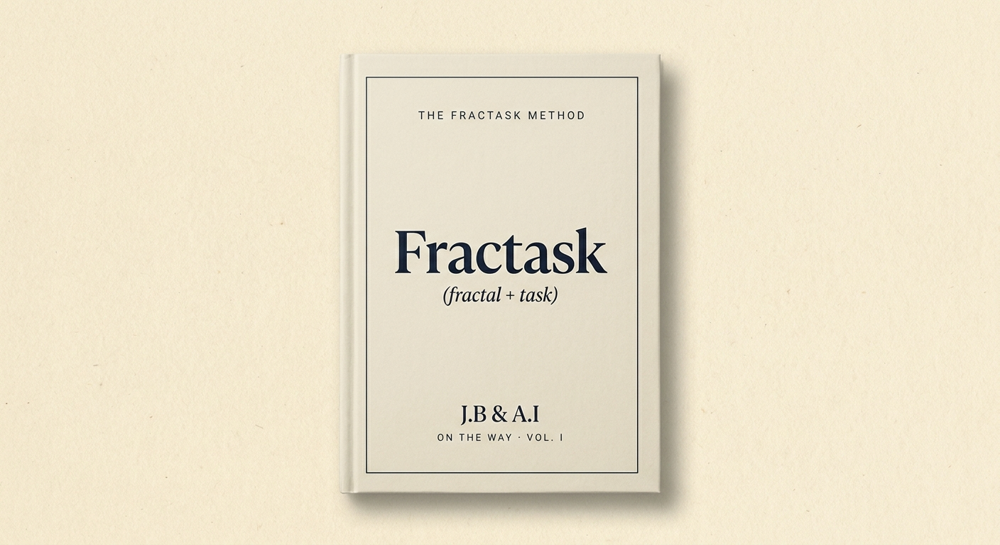
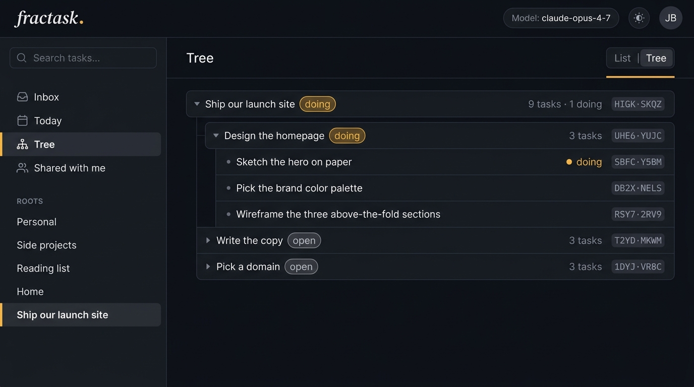
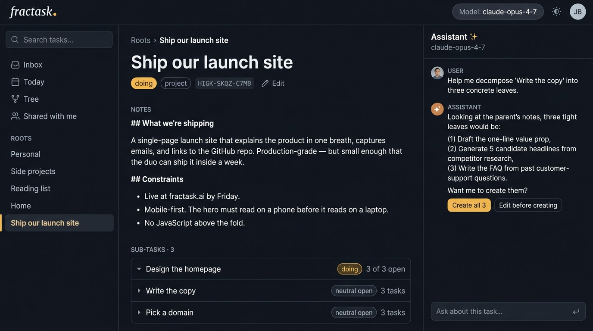

<p align="center">
  <a href="https://fractask.ai">
    
  </a>
</p>

<h1 align="center">Fractask</h1>

<p align="center">
  <strong>Get shit done with your AI partner.</strong><br/>
  An open-source task tree for humans + AI.
</p>

<p align="center">
  <a href="https://fractask.ai">Website</a> ·
  <a href="#-quick-start">Quick start</a> ·
  <a href="#-use-it-with-claude-cursor-anything-with-mcp">Use with Claude</a> ·
  <a href="#-the-fractask-method">The method</a> ·
  <a href="#-hosted">Hosted</a>
</p>

<p align="center">
  
  
  
  
</p>

<br/>

> **One root, many leaves.** A goal becomes a tree. Humans and AI agents pick the leaves they can do, write back what they learned, and the next session picks up where they left off.

<p align="center">
  
</p>

<br/>

## ✨ Why Fractask

- **A real tree, not a queue.** Goals decompose into sub-goals into tasks into sub-tasks. The whole thing is the same shape at every level.
- **Decomposition is a duo activity.** You and your AI break work down together until every leaf is small enough to actually do.
- **Anyone can pull a leaf.** Human or bot — whoever can do the part, does it.
- **State lives on the part.** Notes, files (images, PDFs, anything), and structured agent ↔ human questions stay attached to the task. Cold-start a session and you (or the agent) pick up exactly where you stopped.
- **Agents wait for you, not the other way around.** When an AI needs a decision, it posts a structured prompt (open / choice / approval / pick-an-image) and ends its turn. You answer in the web app; the agent reads your answer on its next call.
- **Same tree from anywhere.** CLI, web app, Claude Code, Cursor, ChatGPT — all read and write the same SQLite/libSQL database.

<br/>

## 🧠 How tasks work

Two axes — **kind** (what shape the thing is) and **status** (what state it's in). That's the whole model.

**Kind**

| Kind | Meaning |
|---|---|
| `entity` | A top-level company or area (no parent). |
| `project` | A project, usually under an entity. Holds children. |
| `task` | An actual to-do (default). |
| `goal` | A qualitative outcome attached to a project or entity. |
| `kpi` | A measurable check-in. Combine with `recurrence` for repeating reviews. |

**Status** — small set, orthogonal, no overlap.

| Status | Meaning |
|---|---|
| `open` | Queued / next-up. Lives in your active queue. |
| `doing` | Active. You or an agent is on it. |
| `review` | **Needs your input** — approvals + agent questions. Both live in one inbox. |
| `done` | Shipped. Hidden by default. |
| `backlog` | Noted, not now, no schedule. Pulled when ready. Lives in a collapsible Backlog section per parent. |
| `snoozed` | Hidden until a wake date. (Backlog has no *when*; snooze does.) |
| `archived` | Dead, kept for reference. |

The active path is `open → doing → review → done`. The other three are "parked" states with different intents.

**Two channels everything else lives on:**

- **Files** — attach images, PDFs, or any artifact to a task with one tool call (`attach_file_from_url`). Local-disk storage by default; flip to any S3-compatible bucket via env vars.
- **Agent ↔ human prompts** — when an AI needs a decision, it posts a structured question (`text` / `choice` / `approval` / `pick_image`) and ends its turn. The task auto-moves to `review`; you answer in the web app; the agent picks up the answer on its next call. No raw HTML, no chat-only commitments — Fractask is the durable channel.

<br/>

## 🚀 Quick start

> **No env vars, no signup.** First run uses a local SQLite file at `~/.getshit/db.sqlite`.

**1. Clone and install**

```sh
git clone https://github.com/Fractask/fractask.git
cd fractask
pnpm install
```

**2. Add your first goal — from the CLI**

```sh
pnpm -r build
node packages/cli/dist/index.js add "Ship the new homepage"
node packages/cli/dist/index.js ls --tree
```

**3. Or run the web app**

```sh
pnpm --filter @getshit/web dev
# open http://localhost:3000
```

**4. (Optional) Sync across machines with Turso**

For multi-device sync, shared trees with other humans, or running an always-on agent on a server:

```sh
export GETSHIT_DB_URL="libsql://your-db.turso.io"
export GETSHIT_DB_AUTH_TOKEN="<your-write-token>"
```

Both the CLI and the MCP server read these on launch. The web app reads from `packages/web/.env.local`.

**5. (Optional) Use S3 for file attachments**

Local storage is the default — attachments land under `./data/files` with zero config. To use any S3-compatible bucket (Cloudflare R2, MinIO, Backblaze B2, AWS S3) instead:

```sh
export GETSHIT_STORAGE=s3
export GETSHIT_S3_BUCKET=your-bucket
export GETSHIT_S3_REGION=auto                   # 'auto' for R2
export GETSHIT_S3_ENDPOINT=https://...           # omit on AWS S3
export GETSHIT_S3_ACCESS_KEY_ID=...
export GETSHIT_S3_SECRET_ACCESS_KEY=...
# Optional: cap per-file size (default 25)
export GETSHIT_MAX_UPLOAD_MB=50
```

See [`packages/web/.env.example`](packages/web/.env.example) for the full list.

> **Note on legacy names.** The internal package names (`@getshit/*`) and env vars (`GETSHIT_*`) are leftover from when the project was called "getshit". The brand is **Fractask**; the identifiers will be renamed in a follow-up release. Real shell commands still use the old names today.

<br/>

## 🤖 Use it with Claude Code

Fractask ships an MCP (Model Context Protocol) server. Twelve small primitives, grouped into three families — task tree, files, and human-in-the-loop. Decomposition (and most other workflows) is something the agent composes; there are no "macro" tools.

**Task tree**

| Tool | What it does |
|---|---|
| `list_tasks` | List children of a parent (or root). Filterable by status / kind / assignee. |
| `get_task` | Read one task with its direct children, attachments, and prompts. |
| `create_task` | Make a new task under a parent. Auto-tags `source: "agent"`. |
| `update_task` | Change title, status, kind, description, etc. |
| `delete_task` | Remove a task and its descendants. |
| `move_task` | Re-parent a task to a different node. |

**Files** — attach images, PDFs, or any artifact to a task. Storage is local by default; flip `GETSHIT_STORAGE=s3` for any S3-compatible bucket (R2, MinIO, B2, AWS).

| Tool | What it does |
|---|---|
| `attach_file_from_url` | Fetch a public http(s) URL server-side and attach the bytes to a task. |
| `list_attachments` | List attachments on a task. |
| `delete_attachment` | Remove an attachment (owner-only). |

**Human-in-the-loop** — when the agent needs a decision, it posts a structured prompt and ends its turn. The task moves to `status="review"` and shows up in your **"Needs your input"** queue (the same bucket as approvals — one inbox for everything that's waiting on you). You answer in the web app, then either mark the task `done` or send it back to `doing` so the agent resumes. The agent picks up the answer on its next `get_task`.

See [**How tasks work**](#-how-tasks-work) above for the full status taxonomy.

| Tool | What it does |
|---|---|
| `ask_human` | Post a `text`, `choice`, `approval`, or `pick_image` prompt against a task. |
| `list_prompts` | List all prompts on a task (pending / answered / cancelled). |
| `cancel_prompt` | Withdraw a prompt the agent no longer needs. |

### Step 1 — register the server

After cloning and `pnpm install`:

```sh
pnpm --filter @getshit/mcp build

claude mcp add --scope user fractask \
  node "$(pwd)/packages/mcp/dist/index.js" \
  -e GETSHIT_DB_URL="$GETSHIT_DB_URL" \
  -e GETSHIT_DB_AUTH_TOKEN="$GETSHIT_DB_AUTH_TOKEN"
```

Confirm it loaded: in Claude Code, run `/mcp` and you should see `fractask` listed with twelve tools across the three families above.

> **Solo-mode shortcut.** If you don't have a Turso DB yet, drop both `-e` flags. The MCP server falls back to `~/.getshit/db.sqlite` (the same file your CLI uses).

### Step 2 — try these prompts

Each one drives a different combination of the six tools. The agent does the calling — you just describe the outcome you want.

**🌱 Plant a goal and let the agent decompose it**

> *"Add a task called 'Ship the new homepage' under my root. Then break it into ~3 sub-parts that I could actually start on Monday morning. Use the Fractask method — chunks of three."*

What happens behind the scenes:
1. `list_tasks(parentId: "root")` — orient on what's already there
2. `create_task(title: "Ship the new homepage", parentId: null)` → returns id `aBc123`
3. `create_task(title: "Pick a domain", parentId: "aBc123")`
4. `create_task(title: "Draft hero copy", parentId: "aBc123")`
5. `create_task(title: "Wire the email capture", parentId: "aBc123")`

When it's done, run `getshit ls --tree` (or open http://localhost:3000) and the tree is there.

**☀️ Morning review — what should I do today?**

> *"Pull my open tasks under 'Ship the new homepage' and tell me which 1–2 I should pick today. Reason from the Fractask method: smallest leaves, biggest unblock value."*

The agent calls `get_task` on the parent, reads the children, and reasons over them. No new tools needed — it's a read-only workflow.

**🤝 Hand off to a sub-agent**

> *"For each open task under 'Ship the new homepage', if it's bigger than a one-sitting effort, break it into three sub-parts. Mark anything you start working on as `doing`."*

This walks the tree: `list_tasks` per parent, decides if a task needs splitting, calls `create_task` for children, and `update_task(status: "doing")` for the one it claims.

**🔄 Re-shape the tree as you learn**

> *"I just realized 'Pick a domain' actually depends on knowing the company name. Move it under 'Lock the brand' instead, and add a sub-task 'Buy the domain' under it."*

→ `move_task` + `create_task`. The tree restructures live; your CLI/web see the change immediately.

**🔍 Find work that fell through the cracks**

> *"Search my tree for any 'doing' tasks I haven't touched in 7 days. List them with their breadcrumb path so I can pick what to drop or finish."*

→ `list_tasks(status: "doing")` then `get_task` for breadcrumbs.

**🖼️ Generate two hero options and let the human pick**

> *"On the 'Ship the new homepage' task, attach two candidate hero images and ask me to pick one."*

→ `attach_file_from_url` × 2 (server fetches and stores) → `ask_human(kind: "pick_image", options: [{ id: "a", attachmentId: …, label: "Cityscape" }, { id: "b", attachmentId: …, label: "Forest" }])`. The task auto-flips to `review`; you click an image in the web app; the agent's next `get_task` returns the answer in `prompts[].answer.selectedIds`.

**🟢 Wait on a go/no-go**

> *"Before deleting these 142 archived tasks older than 90 days, ask me to approve."*

→ `ask_human(kind: "approval", prompt: "Approve deleting 142 archived tasks?")` and exit the turn. On the next invocation, `get_task(taskId).prompts[0].answer.approved` is `true` or `false`.

### Step 3 — see the tree from anywhere

The same SQLite database is read by:

```sh
# Your terminal
getshit ls --tree

# The web app
pnpm --filter @getshit/web dev   # → http://localhost:3000

# Any other MCP client (Claude Desktop, Cursor, custom agents…)
```

Open two of them side-by-side: ask the agent in Claude Code to `create_task`, watch the row appear in the web app within the second.

### Cursor, Claude Desktop, custom agents

Same MCP server, different client config:

- **Claude Desktop** — add to `~/Library/Application Support/Claude/claude_desktop_config.json`:

  ```json
  {
    "mcpServers": {
      "fractask": {
        "command": "node",
        "args": ["/abs/path/to/fractask/packages/mcp/dist/index.js"],
        "env": {
          "GETSHIT_DB_URL": "libsql://...",
          "GETSHIT_DB_AUTH_TOKEN": "..."
        }
      }
    }
  }
  ```

- **Cursor** — add the same block to Cursor's MCP settings (Settings → Features → MCP).
- **HTTP transport** — for hosted agents, run `node packages/mcp/dist/http.js` and point your client at `http://localhost:3210/mcp`.

### What "good MCP" looks like

If you're learning MCP, Fractask is a small enough surface to read end-to-end:

- Twelve tools defined in one file: [`packages/core/src/mcp-tools.ts`](packages/core/src/mcp-tools.ts) — same `TOOLS` array drives stdio and HTTP transports
- Each handler is a thin wrapper over a function in [`packages/core/src/tasks.ts`](packages/core/src/tasks.ts), [`attachments.ts`](packages/core/src/attachments.ts), or [`prompts.ts`](packages/core/src/prompts.ts)
- No "specials" — every workflow (decompose, daily review, "wait for my approval") is composed by the agent from these primitives, not built in. That's the whole point of the Fractask method.

<br/>

<p align="center">
  
</p>

<br/>

## 📐 The Fractask method

Five rules. The product embodies all five.

1. **Start with a goal.** One root. The thing you actually want.
2. **Break it down as a duo.** Decomposition is a conversation, not a monologue. You and your AI split it together until every part is something you can actually do.
3. **Chunk by three.** ~3 sub-parts at each level. Three is what a brain holds. Go as deep as the work needs.
4. **Anyone in the duo picks a part.** Human or bot. Pulled work has an owner.
5. **Everything lives on the part.** Notes, files, links — they belong on the task itself. The next session picks up cold.

Read the full method (30 pages, ~30 min) at **[fractask.ai](https://fractask.ai)**.

<br/>

## 🧱 Architecture

A pnpm monorepo: one `core` brain, three thin adapters that all share the same SQLite database.

```
packages/
  core   — schema, task CRUD, attachments, prompts, storage adapters, LLM abstraction
  cli    — fractask binary (clipanion)
  mcp    — stdio + HTTP MCP server (twelve tools)
  web    — Next.js 15 app (App Router, React 19, Tailwind v4)
```

| Stack | Choice |
|---|---|
| Language | TypeScript (strict + `noUncheckedIndexedAccess` + `exactOptionalPropertyTypes`) |
| Database | SQLite via Drizzle ORM. Local file in solo mode, [Turso](https://turso.tech) (libSQL) when hosted. |
| Web | Next.js 15 (App Router), React 19, Tailwind v4 |
| CLI | clipanion |
| MCP | `@modelcontextprotocol/sdk` |
| AI | `@anthropic-ai/sdk` and `openai`, abstracted behind `@getshit/core/llm` |

<br/>

## 🪄 Hosted Fractask — for teams

For teams who want shared trees without running infrastructure: shared task trees across the org, scheduled agents that run every morning, Slack & WhatsApp inputs, Google sign-in, daily backups. We onboard each team by hand.

[**Book a demo →**](https://fractask.ai/book) · [**fractask.ai/#hosted**](https://fractask.ai/#hosted) · cto@sunbek.com

<br/>

## 🛠️ Development

```sh
pnpm install
pnpm -r build                     # build all packages in dep order
pnpm --filter @getshit/core test  # unit + smoke tests
pnpm --filter @getshit/web  dev
```

Database migrations live in `packages/core/drizzle/`. Author with `pnpm --filter @getshit/core db:generate`, apply with `pnpm --filter @getshit/core db:migrate` (uses your `GETSHIT_DB_URL`).

See [CONTRIBUTING.md](CONTRIBUTING.md) for code style, what we'll merge, and how to open a PR.

<br/>

## 📊 Status

Pre-1.0. APIs and schema can change without warning. The shape is settled enough to use in production for solo work; team features are still in active design. We'll cut a `1.0` once the schema and the MCP primitives have been stable across two breaking-change windows.

<br/>

## 🤝 Contributing

PRs welcome. Read [CONTRIBUTING.md](CONTRIBUTING.md) first — it's short. We follow the [Contributor Covenant](CODE_OF_CONDUCT.md).

The fastest way in: open an issue with the [feature template](.github/ISSUE_TEMPLATE/feature.md) describing the *problem* you'd like to solve. We'll talk shape before either of us writes code.

<br/>

## 📜 License

[MIT](LICENSE) © 2026 Joel Burlin. The Fractask method (the book at [fractask.ai](https://fractask.ai)) is separately licensed CC-BY-4.0.

<br/>

<p align="center">
  <sub>Built around the Fractask method · <a href="https://fractask.ai">fractask.ai</a></sub>
</p>
